# StepManiaX GIF Maker - User Guide

A complete guide to creating, editing, previewing, and uploading animated LED GIFs to StepManiaX dance pads.

## Table of Contents

- [Overview](#overview)
- [Interface](#interface)
- [Canvas Editor](#canvas-editor)
- [Drawing Tools](#drawing-tools)
- [Edit Menu Tools](#edit-menu-tools)
- [Color Palette](#color-palette)
  - [Color Picker](#color-picker)
  - [Panel Colors](#panel-colors)
- [Timeline](#timeline)
- [LED Preview](#led-preview)
- [Undo/Redo & History](#undoredo--history)
- [File Operations](#file-operations)
- [Hardware Preview](#hardware-preview)
- [Composite Preview](#composite-preview)
- [Firmware Upload](#firmware-upload)
- [Settings](#settings)
- [Keyboard Shortcuts](#keyboard-shortcuts)
- [Tips & Tricks](#tips--tricks)

---

## Overview

StepManiaX GIF Maker is a pixel editor purpose-built for the LED panels on StepManiaX dance pads. It produces GIF files compatible with the SMX SDK animation format and can upload animations directly to pad firmware.

---

## Interface

The application uses a dockable panel layout. All panels can be rearranged by dragging their title bars, resized by dragging borders, and docked to any edge or combined as tabs. Your layout is saved automatically.

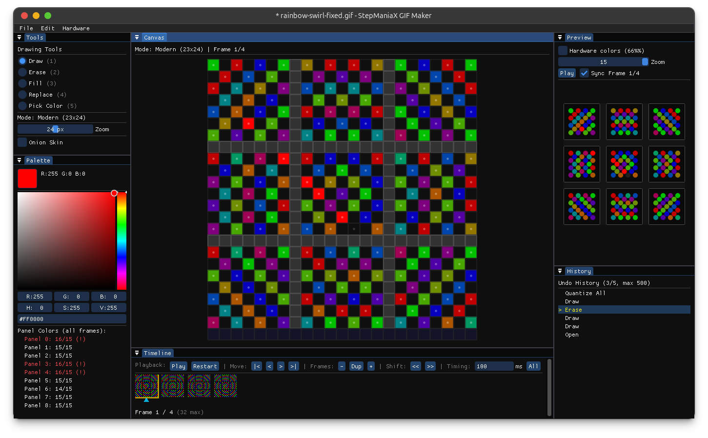

### Panels

| Panel | Purpose |
|-------|---------|
| Canvas | Main pixel editing area |
| Tools | Drawing tool selection |
| Palette | Color picker and per-panel color count |
| Preview | LED preview showing how the animation looks on hardware |
| Timeline | Frame management, playback controls, duration editing |
| History | Undo/redo history list |

---

## Canvas Editor

The canvas displays the full 3×3 panel grid. Only LED positions are editable - non-LED pixels are shown as dark cells and cannot be drawn on.

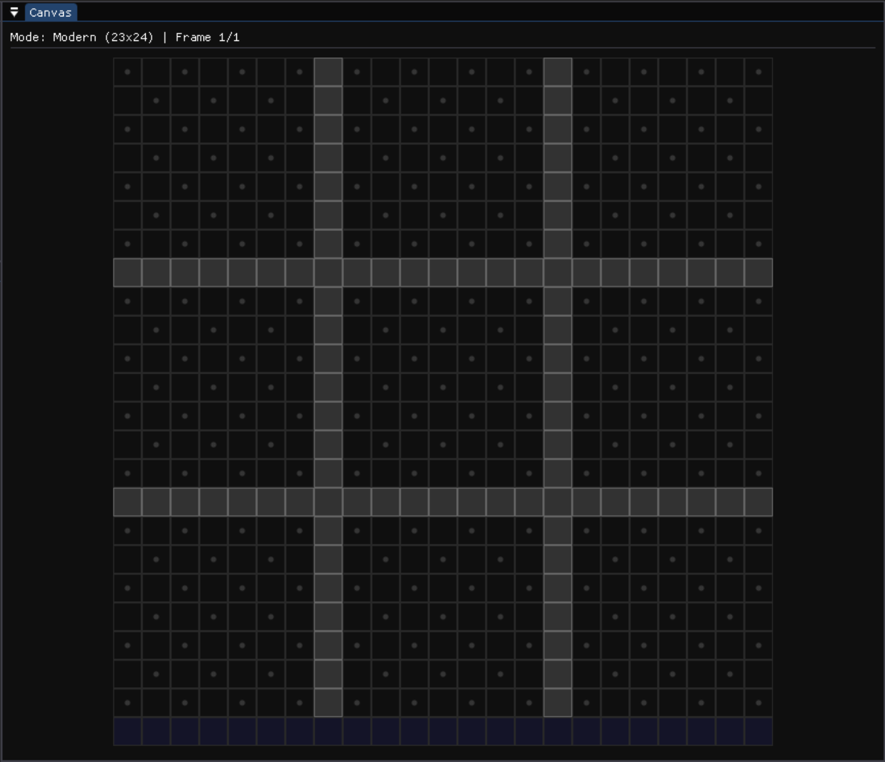

The legacy canvas has no blank spaces as it is simply a 4x4 grid.

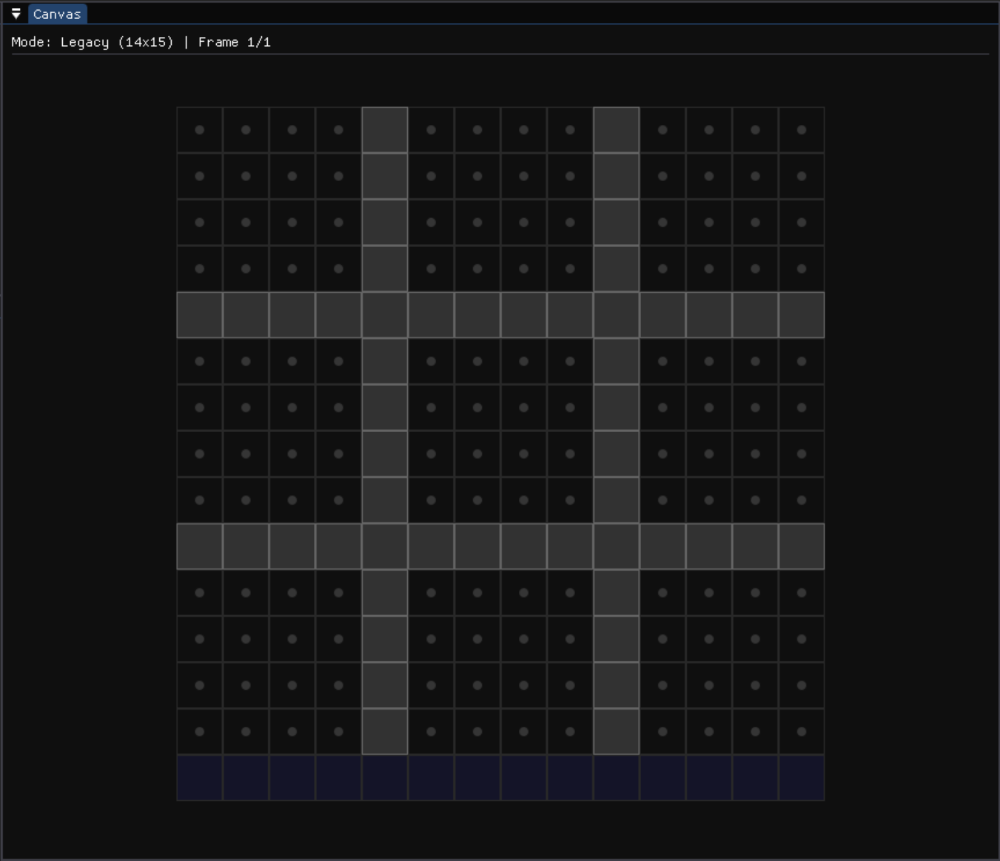

### Canvas Modes

- **Modern (23×24)** - 25 LEDs per panel (4×4 outer + 3×3 inner grid). Supports both host playback and firmware upload.
- **Legacy (14×15)** - 16 LEDs per panel (4×4 grid). Host playback only.

The mode is chosen when creating a new file (File → New) and cannot be changed after creation.

### Canvas Extent

- **Full Pad** - shows all 9 panels in the 3×3 grid. Required for firmware upload.
- **Single Panel** - shows only one panel. Produces a GIF containing just that panel's pixel region. Useful for authoring per-panel judgement GIFs for deadsync. Hardware preview streams the single panel to the physical pad.

### Canvas Target

The target controls which constraints and features are active:

- **Firmware** - enforces the 32-frame and 15-color-per-panel caps. Quantize and Upload to Firmware are available. The loop-end/outro marker is hidden.
- **Host** - no frame or color caps. Enables the loop-end marker and hold/release playback simulation. Firmware upload is disabled.

The target is chosen at creation time (File → New) and can be changed later via **Edit → Canvas Target**. When opening an existing GIF, the editor auto-detects the target: if the file exceeds firmware caps it opens as Host, otherwise as Firmware.

### Navigation

- Ctrl(Cmd)+Mouse Wheel to zoom in/out on the canvas
- The grid shows panel boundaries and gutter lines

---

## Drawing Tools and Options

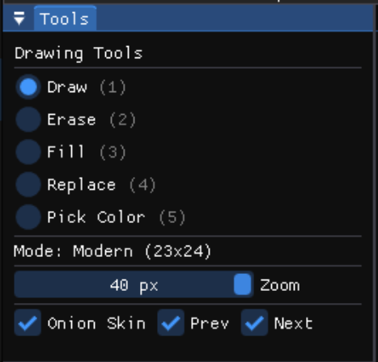

| Tool | Description |
|------|-------------|
| **Draw** | Paint the selected color onto LED pixels |
| **Erase** | Set pixels to black (transparent/off) |
| **Fill** | Flood-fill a contiguous region with the selected color |
| **Replace** | Replace all pixels of the clicked color with the selected color (within the same panel) |
| **Pick Color** | Click a pixel to set it as the active drawing color |

Select tools from the Tools panel or use keyboard shortcuts (1–5 by default).

| Extra Options | Description |
|---------------|-------------|
| **Zoom** | Adjust canvas zoom (8px to 40px) |
| **Onion Skin** | Display previous or next frame overlay |

---

## Edit Menu Tools

### Clear Panel / Clear Panel (All Frames)

Found under **Edit → Clear Panel**. Erases all LED pixels in the selected panel.

- **Clear Panel** - clears the panel on the current frame only.
- **Clear Panel (All Frames)** - clears the panel across every frame in the animation. Useful for resetting a panel without affecting the others.

Both operations are undoable.

### Adjust HSV

Found under **Edit → Adjust HSV**. Opens a dialog to shift hue and adjust the saturation and value of all non-black pixels on the canvas.

| Control | Effect |
|---------|--------|
| **Hue Shift** | Rotate hue (0-360 degrees) |
| **Saturation Gain** | Multiply saturation (0-4x) |
| **Saturation Bias** | Add/subtract to saturation after gain (+/-1.0) |
| **Value Gain** | Multiply brightness (0-4x) |
| **Value Bias** | Add/subtract to brightness after gain (+/-1.0) |

The gain+bias model allows dim or near-black pixels to reach full range: use a high gain to stretch low values, then trim with bias as needed.

- **All Frames** checkbox - when checked, applies to every frame; when unchecked, applies to the current frame only.
- Changes are previewed live on the canvas as you drag the sliders.
- Click **Apply** to commit (creates an undo entry) or **Cancel** to discard.

### Convert Mode

Found under **Edit → Convert to Legacy / Convert to Modern**. Converts the open canvas between the two LED densities in place, keeping every frame, its duration, and the loop markers.

- **Modern → Legacy** drops each panel's inner 3×3 ring and keeps the outer 4×4 (16 LEDs/panel). Because Legacy cannot be uploaded to firmware, the target is switched to Host.
- **Legacy → Modern** keeps the outer 4×4 and adds a blank inner 3×3 ring (25 LEDs/panel). Fill in the inner LEDs afterward if you want them lit.

The outer ring round-trips exactly. The inner ring is not recovered once dropped, so converting Modern → Legacy → Modern leaves the inner LEDs blank. The menu label reflects the conversion available for the current mode, and the change can be undone.

### Canvas Target

Found under **Edit → Canvas Target**. Switches an open canvas between Firmware and Host target modes. See [Canvas Target](#canvas-target) above.

---

## Color Palette

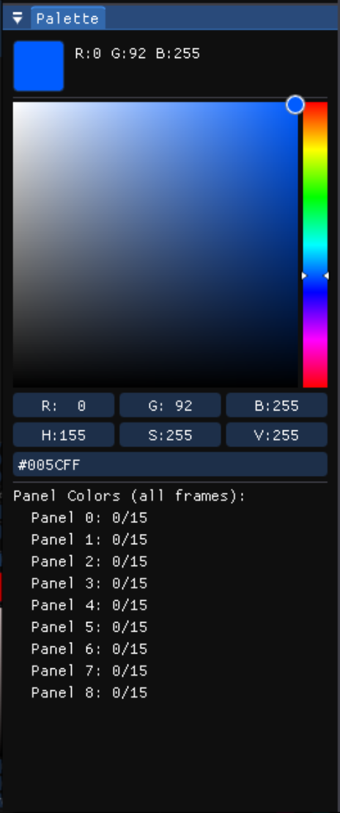

### Color Picker

- Select any color using the hue bar and saturation/value square
- You can also enter exact RGB/HSV/Hex values manually
- The selected color is used by the Draw, Fill, and Replace tools

### Panel Colors

- The palette displays the per-panel color count for the current animation
- Each panel's unique color count is shown across all frames
- **Firmware limit: 15 unique colors per panel** (black doesn't count)
- Panels exceeding 15 colors are highlighted with a warning
- Use **Quantize** (Edit menu) to automatically reduce colors to fit the limit

---

## Timeline

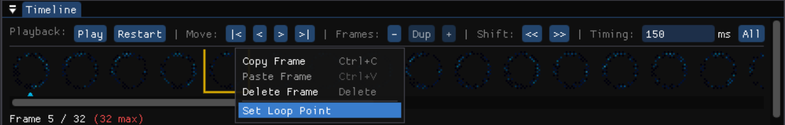

### Frame Management

- **Add Frame** - append a new blank frame
- **Duplicate Frame** - copy the current frame
- **Delete Frame** - remove the current frame
- **Delete All Left / Delete All Right** - right-click a frame to remove every frame before or after it; the loop markers are adjusted to stay valid
- **Reorder** - drag frames or use Shift Left/Right shortcuts

### Playback

- **Play/Pause** - animate the timeline at the configured frame durations
- **Previous/Next Frame** - step through frames one at a time
- **First/Last Frame** - jump to the beginning or end

### Frame Duration

- Click the duration field below a frame to edit it (in milliseconds)
- Default: 100ms per frame
- Range: 10ms – 2550ms

### Loop Point

- Right-click a frame to set it as the loop point
- After the last frame plays, the animation loops back to this frame
- Default loop point is frame 0

### Loop-End Marker (Host Target Only)

When the canvas target is **Host**, right-clicking a frame also exposes a **Set as Loop End** option. The loop-end marker splits the animation into three regions:

1. **Intro** - frames before the loop point; plays once when the animation starts
2. **Loop region** - frames from the loop point through the loop-end frame; repeats continuously while the panel is held
3. **Outro** - frames after the loop-end frame; plays once on release

The loop-end frame is shown with an orange downward-pointing marker in the timeline. Right-click the same frame again to clear it.

This is a [deadsync](https://github.com/pnn64/deadsync) extension for per-panel judgement GIFs. SMX firmware and the official SDK ignore the loop-end marker.

### Hold Simulation (Host Target Only)

When a loop-end marker is set, a **Hold** button appears in the timeline controls. Press and hold it (or use the Hold Sim keybind, default `H`) to simulate deadsync playback:

- The intro plays through once
- The loop region repeats while the button is held
- Releasing snaps to the first outro frame (matching deadsync's snap-on-release behavior)
- Pressing again during the outro jumps back into the loop region

Use this to verify the feel of judgement GIFs - especially the transition from loop to outro - before testing on hardware.

### Total Time

The bottom of the timeline displays the total animation duration in seconds. When a loop-end marker is set, it also shows the intro, loop, and outro durations separately (e.g. `Total: 1.20s (intro 0.10s, loop 0.70s, outro 0.40s)`).

### Preview Speed

A speed slider in the timeline footer adjusts how fast the preview and hardware playback run, from 0.05x to 4x (logarithmic). This is an authoring aid only - it does not change saved frame timing or the exported GIF. Click **1x** to reset to normal speed.

---

## LED Preview

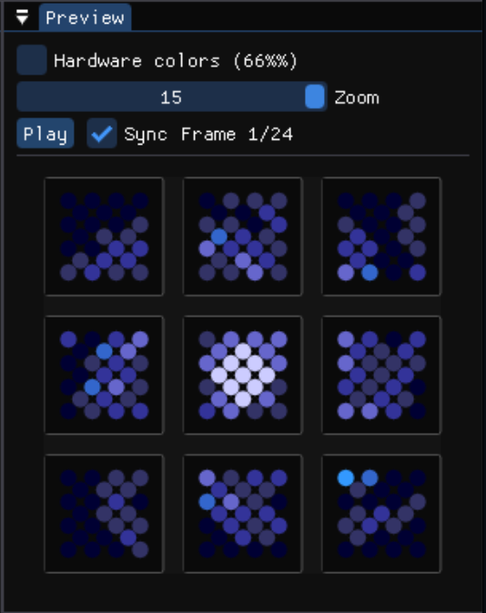

The preview panel shows how the current frame (or animation) will appear on the actual LED hardware. LEDs are rendered as circles matching the physical panel layout.

- In **play mode**, animates with proper frame timing, independently of the timeline
- In **sync frame mode**, shows the current frame that the canvas shows (follows timeline play/loop)

The SMX Hardware clamps the maximum color value to 66% as any values higher than that don't show up any brighter on the LEDs.
To see a more accurate color representation of what the hardware will look like, select the `Hardware colors (66%)` option.

---

## Undo/Redo & History

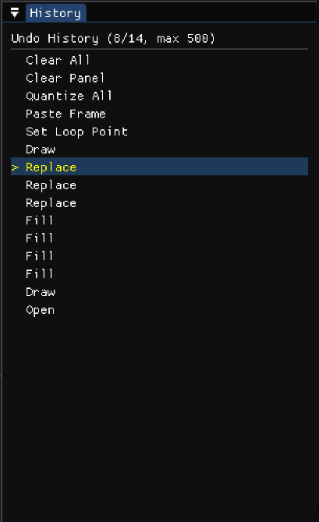

- Full snapshot-based undo/redo (configurable depth, default 100)
- The History panel shows all undo states - click any entry to jump to that state
- The current save point is marked, so you can see if you have unsaved changes

---

## File Operations

### New (Ctrl+N)

Create a new animation. Choose:
- **Size** - Modern (23×24) or Legacy (14×15)
- **Extent** - Full Pad (3×3 grid) or Single Panel
- **Target** - Firmware (upload caps enforced) or Host (deadsync playback, uncapped)

### Open (Ctrl+O)

Open an existing GIF file. The editor auto-detects the mode from the GIF dimensions.

### Save (Ctrl+S) / Save As (Ctrl+Shift+S)

Export the animation as a GIF file compatible with the SMX SDK.

### Import Notes

- GIF files from other sources will be loaded if they match the expected dimensions
- Colors are preserved exactly - no quantization is applied on import
- The loop point marker is read from the flag row if present

---

## Hardware Preview

Stream your animation to a connected StepManiaX pad in real-time.

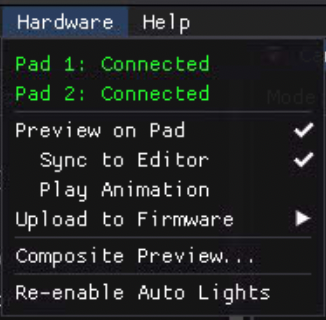

### Sync Mode

Mirrors the editor's current frame to the pad. As you draw or navigate frames, the pad updates instantly.

### Play Mode

Plays the animation on the pad independently with proper frame timing, regardless of what the editor is showing.

### Setup

1. Connect your SMX pad via USB
2. Go to **Hardware → Preview on Pad**
3. Select Sync or Play mode
4. Choose which pad (Pad 1, Pad 2, or Both)

---

## Composite Preview

Load both a **released** and **pressed** animation to preview how they overlay based on live pad input.

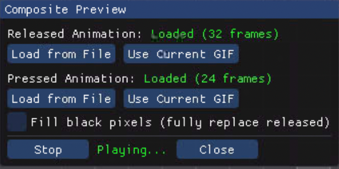

- The released animation plays continuously
- When you step on a panel, the pressed animation overlays on top
- Black pixels in the pressed animation are transparent (the released animation shows through)
- **Fill Black** option replaces black with (1,1,1) for full panel replacement

### Setup

1. Go to **Hardware → Composite Preview**
2. Load a released GIF and a pressed GIF
3. Step on the pad to see the overlay behavior

---

## Firmware Upload

Write animations permanently to pad EEPROM for offline playback (no computer needed).

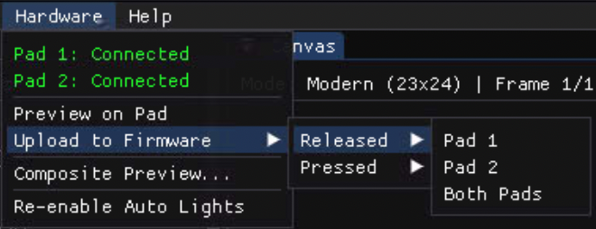

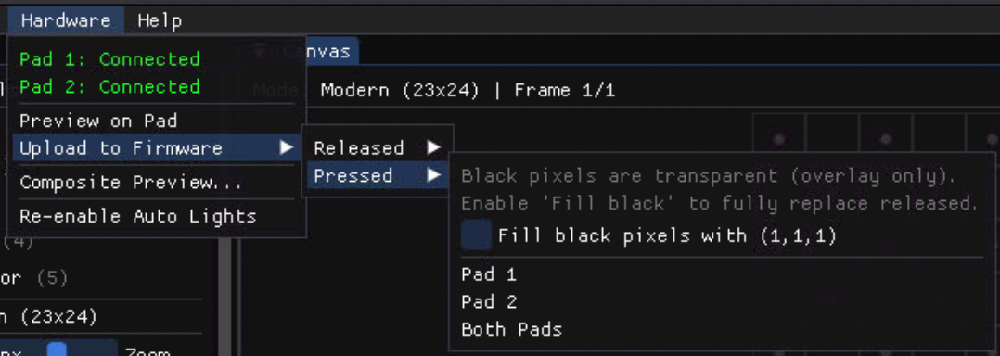

### Requirements

- **Modern mode (23×24) only**
- **Max 32 frames** per animation
- **Max 15 colors per panel** across all frames
- A connected SMX pad

### Steps

1. Ensure your animation meets the constraints above
2. Go to **Hardware → Upload to Firmware**
3. Select animation type: Released or Pressed
4. Select target: Pad 1, Pad 2, or Both
5. Click Upload and wait for completion

### Fill Black Option

For pressed animations, enable "Fill Black" to replace black pixels with (1,1,1). This makes the pressed animation fully opaque instead of showing the released animation through black pixels.

---

## Settings

Access via **Edit → Settings**.

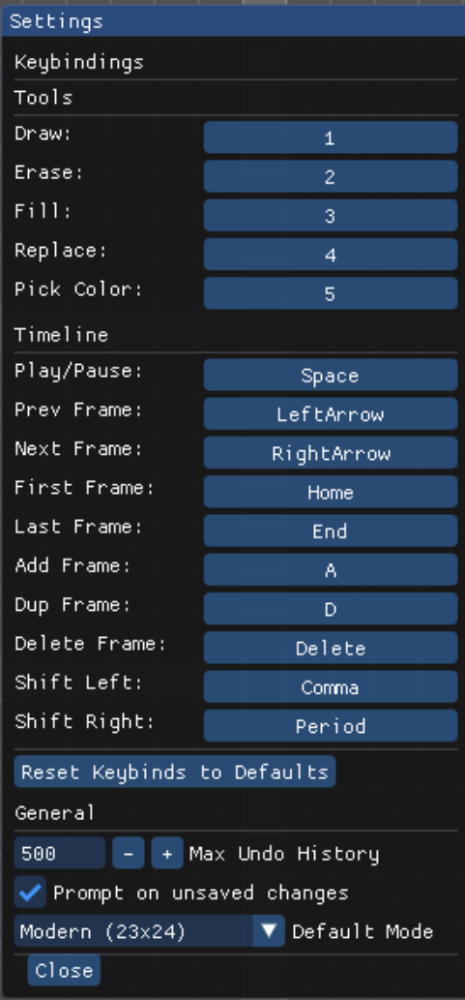

### General

- **Default mode** - Legacy or Modern for new files
- **Max undo history** - number of undo states to keep (default 100)
- **Prompt on unsaved changes** - warn before closing with unsaved work

### Keybindings

All tool and timeline shortcuts are remappable. Click a binding and press the desired key to reassign it.

---

## Keyboard Shortcuts

| Action | Default | Notes |
|--------|---------|-------|
| New | Ctrl+N | |
| Open | Ctrl+O | |
| Save | Ctrl+S | |
| Save As | Ctrl+Shift+S | |
| Quit | Ctrl+Q | |
| Undo | Ctrl+Z | |
| Redo | Ctrl+Y | |
| Copy Frame | Ctrl+C | |
| Paste Frame | Ctrl+V | |
| Draw | 1 | Remappable |
| Erase | 2 | Remappable |
| Fill | 3 | Remappable |
| Replace | 4 | Remappable |
| Pick Color | 5 | Remappable |
| Play/Pause | Space | Remappable |
| Prev/Next Frame | ←/→ | Remappable |
| First/Last Frame | Home/End | Remappable |
| Add Frame | A | Remappable |
| Duplicate Frame | D | Remappable |
| Delete Frame | Delete | Remappable |
| Shift Frame | ,/. | Remappable |
| Hold Sim | H | Remappable; only active when a loop-end marker is set |
| Adjust HSV | Ctrl+E | Fixed shortcut |

On macOS, Ctrl shortcuts use Cmd instead.

---

## Tips & Tricks

- **Start with the released animation** - design your idle/attract pattern first, then create a pressed animation that complements it.
- **Use Pick Color liberally** - when editing existing animations, pick colors from the canvas to stay within the 15-color limit.
- **Check color counts early** - the palette panel shows per-panel counts. Fix overages before attempting firmware upload.
- **Quantize as a last resort** - automatic quantization uses nearest-neighbor matching which may not produce ideal results. Manual color reduction gives better control.
- **Test with hardware preview** - always preview on the actual pad before uploading to firmware. Colors appear differently on LEDs vs. your monitor.
- **Use composite preview** - verify that your pressed animation looks good overlaid on the released animation with actual pad input.
- **Frame duration matters** - the pad refreshes at 30 FPS, so durations below ~33ms won't produce visible differences on hardware.
- **Black = transparent** - in pressed animations, black pixels let the released animation show through. Use (1,1,1) if you want "almost black" that's still opaque.
- **Use Host target for deadsync judgement GIFs** - switch the canvas target to Host (Edit → Canvas Target) to unlock the loop-end marker and remove firmware caps when authoring per-panel GIFs for deadsync.
- **Author judgement GIFs on single panels** - create a Single Panel canvas for cleaner focus when designing per-panel judgement GIFs. Hardware preview still works on single-panel canvases.
- **Use HSV Adjust to recolor existing animations** - instead of redrawing, open Adjust HSV, shift the hue, and apply to all frames to get a quick color variant.
- **Slow preview to time the outro** - set preview speed to 0.25x or lower before pressing Hold Sim to see exactly when the snap to outro happens and whether the transition feels right.
- **Use Clear Panel (All Frames) to reset one panel** - when a single panel's design is wrong across the whole animation, Clear Panel (All Frames) wipes just that panel without touching the others.
